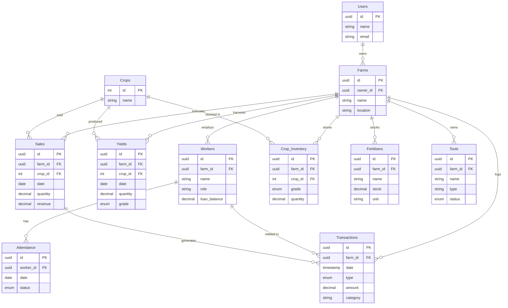

# Database Schema Design for FarmSight 360

Based on the current application requirements and mock data analysis, here is the proposed relational database schema.

## Tables

### 1. Users
Stores user authentication and profile information.
- `id` (Primary Key, UUID)
- `name` (String)
- `email` (String, Unique)
- `password_hash` (String)
- `created_at` (Timestamp)

### 2. Farms
**[NEW]** Represents the farm entity. Enables multi-tenancy.
- `id` (Primary Key, UUID)
- `owner_id` (Foreign Key -> Users.id)
- `name` (String)
- `location` (String)
- `created_at` (Timestamp)

### 3. Crops
Lookup table for available crops.
- `id` (Primary Key, Integer)
- `name` (String, Unique) - e.g., 'Tomatoes', 'Potatoes'

### 4. Workers
Stores farm worker details.
- `id` (Primary Key, UUID)
- `farm_id` (Foreign Key -> Farms.id) **[NEW]**
- `name` (String)
- `role` (String)
- `contact` (String)
- `per_day_salary` (Decimal)
- `loan_balance` (Decimal)
- `created_at` (Timestamp)

### 5. Attendance
Tracks daily attendance for workers.
- `id` (Primary Key, UUID)
- `worker_id` (Foreign Key -> Workers.id)
- `date` (Date)
- `status` (Enum)
- `created_at` (Timestamp)

### 6. Yields
Records harvest data.
- `id` (Primary Key, UUID)
- `farm_id` (Foreign Key -> Farms.id) **[NEW]**
- `crop_id` (Foreign Key -> Crops.id)
- `date` (Date)
- `quantity` (Decimal)
- `unit` (String)
- `grade` (Enum)
- `created_at` (Timestamp)

### 7. Sales
Records sales of produce.
- `id` (Primary Key, UUID)
- `farm_id` (Foreign Key -> Farms.id) **[NEW]**
- `crop_id` (Foreign Key -> Crops.id)
- `date` (Date)
- `quantity` (Decimal)
- `unit` (String)
- `grade` (Enum)
- `revenue` (Decimal)
- `created_at` (Timestamp)

### 8. Crop_Inventory
Stores current available stock for each crop and grade.
- `id` (Primary Key, UUID)
- `farm_id` (Foreign Key -> Farms.id) **[NEW]**
- `crop_id` (Foreign Key -> Crops.id)
- `grade` (Enum)
- `quantity` (Decimal)
- `unit` (String)
- `last_updated` (Timestamp)
- **Constraint**: Unique combination of (`farm_id`, `crop_id`, `grade`)

### 9. Fertilisers
Manages fertiliser inventory (Inputs).
- `id` (Primary Key, UUID)
- `farm_id` (Foreign Key -> Farms.id) **[NEW]**
- `name` (String)
- `stock` (Decimal)
- `unit` (String)
- `last_updated` (Timestamp)

### 10. Tools
Manages farm tools and machinery (Assets).
- `id` (Primary Key, UUID)
- `farm_id` (Foreign Key -> Farms.id) **[NEW]**
- `name` (String)
- `type` (String)
- `status` (Enum)
- `purchase_date` (Date)
- `last_maintenance_date` (Date, Nullable)
- `created_at` (Timestamp)

### 11. Transactions
Central ledger for all financial movements.
- `id` (Primary Key, UUID)
- `farm_id` (Foreign Key -> Farms.id) **[NEW]**
- `date` (Timestamp)
- `type` (Enum)
- `description` (String)
- `amount` (Decimal)
- `category` (String)
- `related_entity_type` (String, Nullable)
- `related_entity_id` (UUID, Nullable)

## Relationships & Logic

- **Multi-Tenancy**: All queries MUST filter by `farm_id`.
    - Example: `SELECT * FROM Yields WHERE farm_id = current_user_farm_id`
- **Inventory Management**:
    - **New Yield**: Updates `Crop_Inventory` for the specific `farm_id`.
- **Row Level Security (RLS)**:
    - If using Supabase/Postgres, enable RLS on all tables.
    - Policy: `auth.uid() = (SELECT owner_id FROM Farms WHERE id = table.farm_id)`

## ER Diagram (Mermaid)

